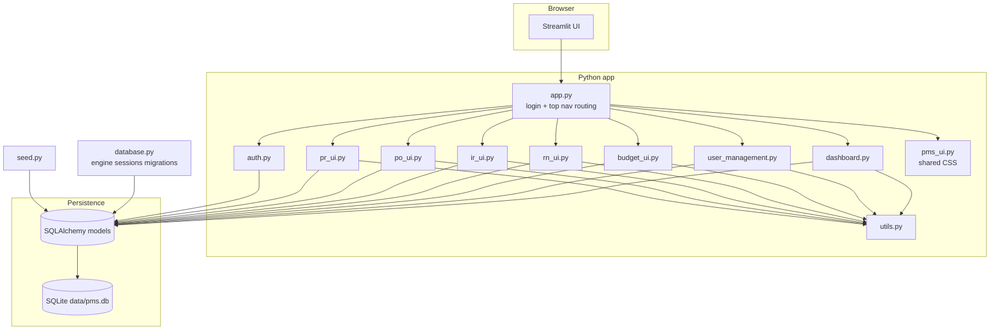
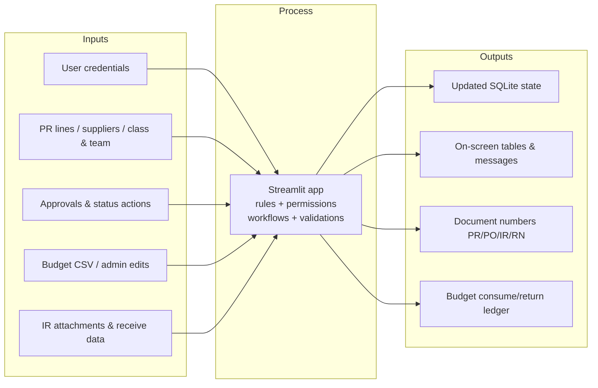

# Lab 1 — Deliverables (Components B–E + Reflection)

This document is aligned with the **Purchasing Management System** in this repository (Streamlit + SQLite + SQLAlchemy). Course materials may refer to this implementation as the **Wayfinder** purchasing app.

---

## Component B — Deliverables

### AI usage log

Document **at least three** AI-assisted interactions. Below are **example entries** modeled on building this stack; **replace the prompts and outcomes with your own Cursor history** so the log is authentic to your work.

| # | Prompt you gave | What the AI produced | First try? | What you fixed (if not) |
|---|-----------------|----------------------|------------|-------------------------|
| 1 | *Example:* “Scaffold a Streamlit purchasing app with login, SQLite, and separate modules for PR, PO, IR, RN, and budget.” | File layout (`app.py`, `models.py`, `database.py`, `*_ui.py`), `requirements.txt`, and README run instructions. | Partially | Adjusted imports, merged duplicate migration logic, and matched class naming to the lab rubric. |
| 2 | *Example:* “Purchase request submit should block when the PR total exceeds the team’s remaining budget; show a clear error.” | Helper using `team_budget_cap_remaining` and `st.error` messaging in `pr_ui.py`. | No | First draft compared PR to class budget only; redirected logic to **team** cap and wired it into submit/save paths. |
| 3 | *Example:* “Style login page purple background, cream app shell, green primary buttons—keep Streamlit widgets usable.” | CSS in `app.py` / `pms_ui.py` for background and button colors. | No | Login **Log in** button used white text on yellow (`#F7DC6F`); contrast failed WCAG. Changed label text to dark (`#1a1a1a`) (see accessibility section). |

**Your prompts (paste from Cursor):**

1. …  
2. …  
3. …  

---

### Accessibility baseline results

| Check | Result | Notes / fix |
|-------|--------|-------------|
| **Color contrast** | **Pass** (after fix) | Login submit used **white text on `#F7DC6F`** → likely **fail** vs WCAG AA. **Fix applied:** `app.py` login form CSS now uses **`color: #1a1a1a`** on the yellow button (normal-weight text). Re-check primary green buttons (`#16a34a` on white) with a contrast tool; they generally pass for white label text. |
| **Semantic headings** | **Pass** (with caveat) | Logged-in areas use Streamlit **`st.title` / `st.subheader`** (e.g. Dashboard, Budget management, workspace sections)—these map to heading semantics in the DOM. **Caveat:** Login welcome text is a styled **`<p>`** (`.login-welcome`), not an `<h1>`; acceptable for a single screen, but add `st.title` hidden for SRs only if your auditor requires a literal `<h1>` on every route. |

Tools: browser DevTools Accessibility tree, axe/WAVE, or WebAIM Contrast Checker.

---

### Reflection (Component B — submit as instructed)

*Write 3–5 sentences in your own words. Prompts below are guides only.*

**What surprised you about AI-assisted coding?** Was it easier or harder than you expected? What moment made you think “wow” or “wait, that is not right”?

*[Your paragraph here.]*

**What did the AI get wrong?** Errors, unexpected behavior, or code that did not match the request? How did you fix it?

*[Your paragraph here.]*

**Could you explain your code?** Pick one section—could you walk a classmate through it line by line without Cursor?

*[Your paragraph here. For example: `attempt_login` in `auth.py`, `recalculate_pr_budget` in `utils.py`, or a workflow block in `pr_ui.py`.]*

**What did you learn from the interview?** How did talking to **Dorothy** (Program Coordinator, Student Purchasing) change what you built vs. what you might have built without that conversation?

*[Your paragraph here. Example angles: approval steps, budget rules, language/labels, who sees which menu, edge cases schools hit in real life.]*

---

## Component C — Deliverables

### Architecture diagram



**Narrative:** The browser runs the Streamlit app. `app.py` authenticates, applies shared styling, and routes to feature modules. Each `*_ui.py` module reads/writes through SQLAlchemy models; `database.py` owns the engine, migrations, and session factory; `seed.py` initializes an empty database.

---

### Design decision log

| Decision | Choice | Rationale |
|----------|--------|-----------|
| UI framework | Streamlit | Fast lab UIs, forms/tables without a separate front-end build. |
| Database | SQLite file under `data/` | Zero server setup; portable for grading and demos. |
| ORM | SQLAlchemy 2.x + declarative models | Typed models, migrations via `database.py`, relationships for PR→lines→PO→IR. |
| Auth | Session state + bcrypt hashes in `users` | Matches lab scope; not OIDC/production SSO. |
| Module split | One workspace file per document type (`pr_ui`, `po_ui`, …) | Easier navigation and parallel work than a single giant file. |
| Permissions | `Permission` + `MenuVisibility` + role flags | Supports row-level “own only” and field-level edit rules for PRs. |
| Document numbers | `DocumentNumbering` table + `utils.next_document_number` | Central place for year rollover and padded sequences. |
| Budget | `BudgetTransaction` consume/return + class/team caps | Mirrors procurement reserving and releasing funds on status changes. |

---

## Component D — Deliverables

### Validation results (smoke-test table)

Run: `streamlit run app.py` → [http://localhost:8501](http://localhost:8501). Use demo accounts from `README.md`.

| # | Scenario | Steps | Expected | Pass? |
|---|----------|-------|----------|-------|
| 1 | Fresh DB seed | Delete `data/pms.db` (optional), start app | App starts; roles/users/seed PRs load without traceback | ☐ |
| 2 | Login | `requester@school.com` / `test123` | Lands on app with top navigation | ☐ |
| 3 | Invalid login | Wrong password | “Invalid credentials.” | ☐ |
| 4 | Dashboard | Open Dashboard | Title “Dashboard”; no error | ☐ |
| 5 | PR workspace | Open Purchase requests | List shows seeded PRs; filters usable | ☐ |
| 6 | Role gate | As non-master, navigate to User management (if visible) / direct test | “Master only.” or menu hidden per `MenuVisibility` | ☐ |
| 7 | PO workspace | As `purchasing@school.com` | Purchase orders section loads | ☐ |
| 8 | Budget | As master, Budget management | Page loads; CSV path documented in UI | ☐ |
| 9 | Logout / session | Use logout if implemented; or restart | Re-login required as expected | ☐ |

**Completed by:** _______________ **Date:** _______________

---

### Screenshot (running app)

**Requirement:** At least one screenshot showing a **tested** feature (e.g. Dashboard after login, Purchase requests list, or Budget management).

**Suggested file location (add to repo or zip):** `screenshots/running-app-smoke.png`

*(Replace this line with an embedded image or your submission portal upload note.)*

---

### Quality gate checklist

- [ ] `pip install -r requirements.txt` succeeds on a clean venv  
- [ ] `streamlit run app.py` starts with no import errors  
- [ ] At least one demo login works as documented in `README.md`  
- [ ] Smoke-test table above completed (all checked or failures noted)  
- [ ] No committed secrets (passwords in README are demo-only; `.env` not required)  
- [ ] `data/` remains gitignored; DB is reproducible via first-run seed  
- [ ] Accessibility spot-checks documented in Component B  

---

## Component E — Deliverables (Wayfinder / purchasing app)

### Implementation in this repo

| Area | Location |
|------|----------|
| Entry + routing + login shell | `app.py` |
| Data model | `models.py` |
| DB engine, migrations, helpers | `database.py` |
| Initial data | `seed.py` |
| Auth | `auth.py` |
| Workspaces | `pr_ui.py`, `po_ui.py`, `ir_ui.py`, `rn_ui.py`, `budget_ui.py`, `dashboard.py`, `user_management.py` |
| Shared styling | `pms_ui.py` |
| Validation / numbering / budget math | `utils.py` |

**Data layout:** SQLite database `data/pms.db` with tables for roles, users, students, classes, teams, suppliers, purchase requests (+ line items, messages, status history), purchase orders, inventory receipts (+ attachments/history), return notes, budget transactions, document numbering, permissions, and menu visibility.

---

### I / P / O diagram (Wayfinder app)



---

### Edge-case validation notes (2)

1. **PR total vs team budget cap**  
   - **Behavior:** Saving/submitting can be blocked when the PR total exceeds **remaining team budget** (`team_budget_cap_remaining`, errors in `pr_ui.py`).  
   - **Why it matters:** Prevents overspending against allocations; mirrors how student purchasing is capped per team/class in the interview scenario.

2. **Invalid credentials**  
   - **Behavior:** `attempt_login` returns no user; UI shows “Invalid credentials.”  
   - **Why it matters:** Avoids leaking whether an email exists; keeps failed auth obvious without crashing.

*(Optional second technical edge case you can cite in viva: empty DB → `seed_if_empty` runs once; schema migrations in `migrate_sqlite_schema` for existing files.)*

---

### Data integrity assert (in code)

**Location:** `seed.py`, at the end of `_seed_data`, after all roles are inserted.

**Purpose:** After seeding, the database must contain exactly **five** roles (`master`, `requester`, `approver`, `head_of_purchasing`, `purchasing_team`). If that invariant breaks, seed logic regressed.

```python
seeded_roles = session.query(Role).count()
assert seeded_roles == 5, f"Expected 5 seeded roles, got {seeded_roles}"
```

---

### Prompt log excerpt (initial + one refinement)

| Stage | Prompt (excerpt) | What changed and why |
|-------|------------------|---------------------|
| **Initial** | *Example:* “Build a role-based purchasing web app with PR → approval → PO → receiving → returns, using Python and a file database.” | Set overall scope and stack. |
| **Refinement** | *Example:* “Use team-level budget caps on submit, not just class budget, and show remaining budget next to the PR total.” | First version aligned totals to the wrong budget dimension; refinement matched **Dorothy-style** rules (teams compete for finite allocations). |

**Your excerpt (paste real prompts):** …  

---

## Submission checklist (quick)

- [ ] Component B: AI log (≥3), accessibility, reflection  
- [ ] Component C: architecture diagram, design log  
- [ ] Component D: smoke table, screenshot, quality gates  
- [ ] Component E: code/data description, I/P/O, 2 edge cases, assert location, prompt excerpt  

---

*Generated for repository: `Lab1_purchasing_app` — align names with your course’s “Wayfinder” wording if the syllabus uses a different product name.*
