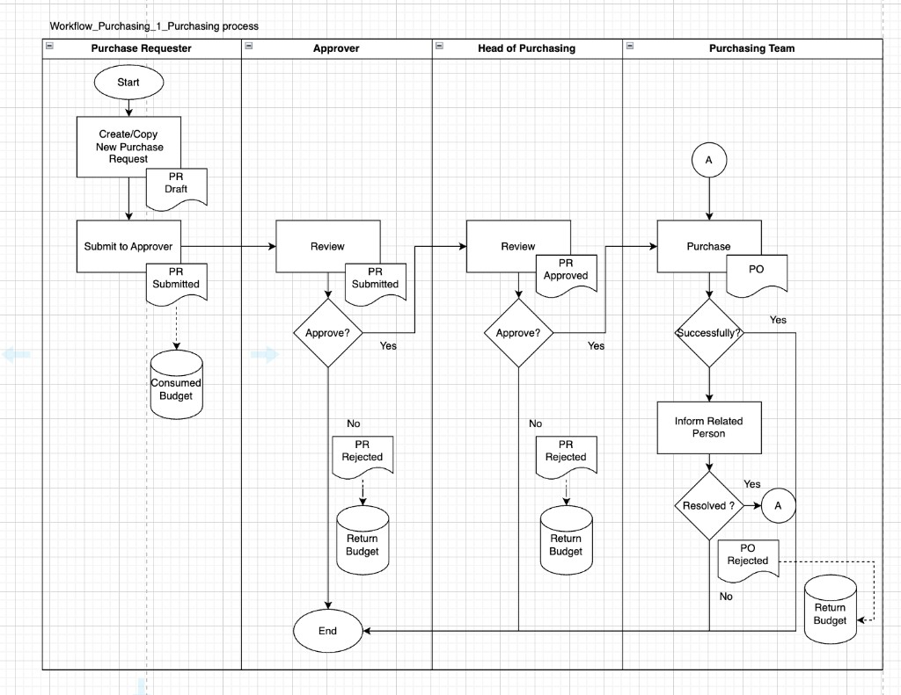
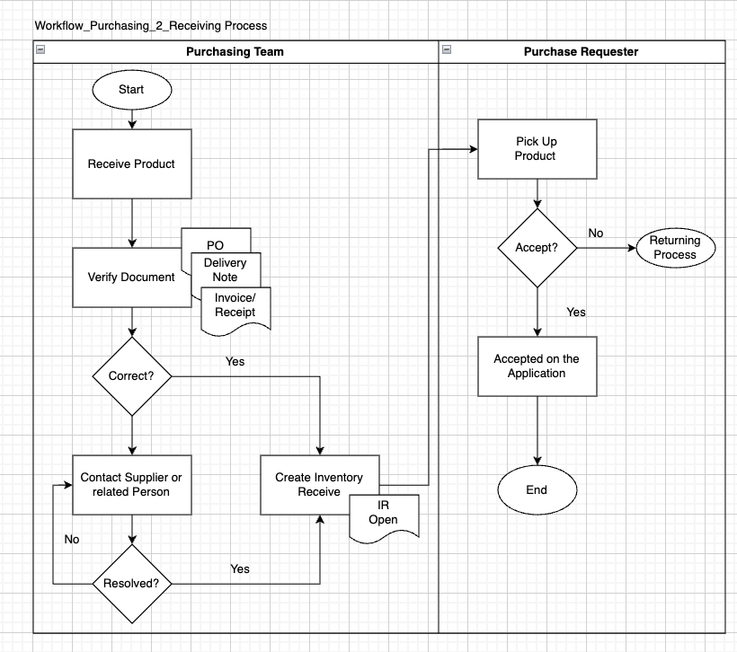
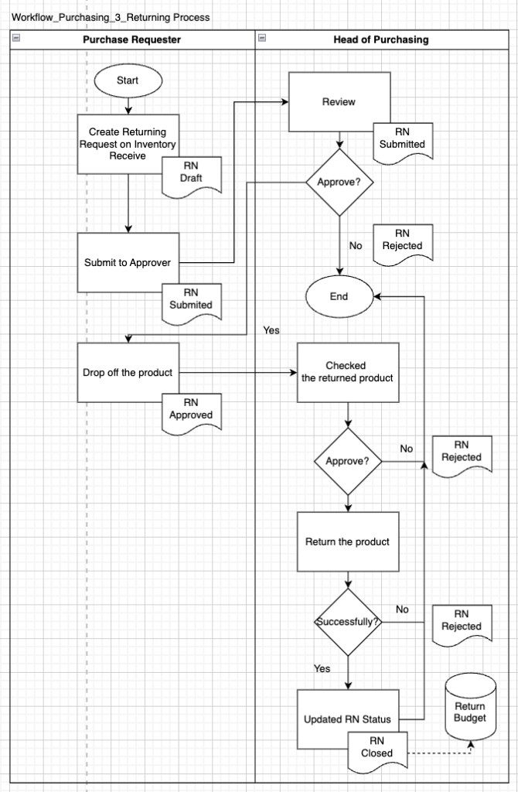

# Lab 1 — Purchasing Management System

Streamlit web app for class purchasing workflows: purchase requests (PRs), approvals, purchase orders (POs), inventory receiving, return notes, user management, and budget assignment (including CSV import).

## Application preview

Examples of the running web application (Streamlit UI).

### Log in page


### Purchase request page


### PO summary list


## Work flow

Reference swimlane diagrams for the three main purchasing processes: PR lifecycle, receiving, and returns.

### 1. Purchasing process

Requester → Approver → Head of purchasing → Purchasing team. States include PR draft, submitted, approved/rejected, PO creation, and budget **consume** on submit / **return** on rejection.



### 2. Receiving process

Purchasing team verifies PO, delivery note, and invoice; may contact the supplier if needed, then creates an **IR open**. Requester picks up the product and accepts (or enters the returning flow if not accepted).



### 3. Returning process

Requester creates a return from inventory receive, submits to the head of purchasing, drops off the product after approval, then head of purchasing inspects, completes the return, and closes the RN (**return budget** on close).




---

## Prerequisites

Before you install anything, check the following:

| Requirement | Notes |
|-------------|--------|
| **Python** | **3.10 or newer** (3.11+ recommended). Check with `python3 --version` or `python --version`. |
| **Git** (optional) | Only needed if you clone the repository. You can also download the project as a ZIP and unpack it. |
| **Web browser** | Chrome, Firefox, Edge, or Safari — used to open the Streamlit UI. |
| **Network** | First `pip install` needs internet; running the app is local only. |

**macOS / Linux:** `python3` is usually available; you may need to install Python from [python.org](https://www.python.org/downloads/) or use Homebrew (`brew install python`).

**Windows:** Install from [python.org](https://www.python.org/downloads/) and enable **“Add python.exe to PATH”** during setup. Use **PowerShell** or **Command Prompt** for the commands below.

---

## Installation and setup

All commands below assume your terminal’s **current directory** is the project folder that contains `app.py` and `requirements.txt` (e.g. `Lab1_purchasing_app`).

### 1. Open the project folder

If you cloned with Git:

```bash
git clone <repository-url>
cd Lab1_purchasing_app
```

If you use a ZIP, unpack it, then:

```bash
cd path/to/Lab1_purchasing_app
```

### 2. Create a virtual environment

A virtual environment keeps this app’s packages separate from other Python projects.

**macOS / Linux:**

```bash
python3 -m venv .venv
```

**Windows (Command Prompt or PowerShell):**

```bash
python -m venv .venv
```

This creates a `.venv` folder in the project. It is normal for `.venv` to be listed in `.gitignore` so it is not committed.

### 3. Activate the virtual environment

You must activate the venv **every time** you open a new terminal session before running the app.

**macOS / Linux (bash/zsh):**

```bash
source .venv/bin/activate
```

**Windows — Command Prompt:**

```bash
.venv\Scripts\activate.bat
```

**Windows — PowerShell:**

```bash
.venv\Scripts\Activate.ps1
```

If PowerShell blocks scripts, run once (as Administrator if needed):  
`Set-ExecutionPolicy -ExecutionPolicy RemoteSigned -Scope CurrentUser`

When activation works, your prompt usually shows `(.venv)`.

### 4. Upgrade pip (recommended)

```bash
python -m pip install --upgrade pip
```

### 5. Install Python dependencies

Install everything required by this app from `requirements.txt`:

```bash
pip install -r requirements.txt
```

That installs at least:

- **streamlit** — web UI framework  
- **sqlalchemy** — database ORM and SQLite access  
- **pandas** — tables and CSV handling (e.g. budget import)  
- **bcrypt** — password hashing for login  
- **plotly** — interactive charts (e.g. dashboard PR-by-status bar chart)  

**Verify imports (optional):**

```bash
python -c "import streamlit, sqlalchemy, pandas, bcrypt, plotly; print('OK')"
```

If this prints `OK`, the environment is ready.

---

## Running the application

With the virtual environment **still activated** and your terminal in the project folder:

```bash
streamlit run app.py
```

Streamlit prints a **Local URL** (by default [http://localhost:8501](http://localhost:8501)). Open that address in your browser.

- **Stop the server:** press `Ctrl+C` in the terminal.  
- **Another app on port 8501:** run `streamlit run app.py --server.port 8502` (or any free port).

**Optional (faster reload on file changes):**

```bash
pip install watchdog
```

---

## Database and first-time seed

| Topic | Detail |
|-------|--------|
| **Where data lives** | SQLite file: `data/pms.db`. The `data/` directory is created automatically and is **gitignored** (your local DB is not pushed to Git by default). |
| **On startup** | The app creates tables if needed and runs lightweight **schema migrations** in `database.py`. |
| **Empty database** | If there are no roles yet, `seed.py` loads demo roles, users, classes, teams, suppliers, sample PRs/POs/IRs, and permissions (`seed_if_empty`). You only get this full seed **once** per new `pms.db`. |
| **After seed** | Use the [demo accounts](#demo-accounts-after-seed) below to log in. |

### Resetting to a clean demo database

To wipe local data and force a **fresh seed** on next launch:

1. Stop Streamlit (`Ctrl+C`).  
2. Delete the file `data/pms.db` (and optionally the folder `data/ir_attachments/` if you want to clear uploads).  
3. Run `streamlit run app.py` again.

---

## Troubleshooting

| Problem | What to try |
|---------|-------------|
| `python` / `pip` not found | Use `python3` and `pip3` on macOS/Linux, or reinstall Python with **PATH** enabled on Windows. |
| `ModuleNotFoundError: No module named 'sqlalchemy'` (or pandas, bcrypt, plotly) | Activate `.venv`, then run `pip install -r requirements.txt` again. |
| Wrong package versions | In the activated venv: `pip install --upgrade -r requirements.txt`. |
| Port already in use | `streamlit run app.py --server.port 8502` |
| Blank page or Streamlit errors | Read the stack trace in the terminal; confirm you ran `streamlit run app.py` from the folder that contains `app.py`. |
| Permission errors on `data/` | Ensure the process can create/write the `data/` directory next to `app.py`. |

---

## Demo accounts (after seed)

| Role | Email | Password |
|------|--------|----------|
| Master | master@school.com | `master123` |
| Requester | requester@school.com | `test123` |
| Approver | approver@school.com | `test123` |
| Head of purchasing | head@school.com | `test123` |
| Purchasing team | purchasing@school.com | `test123` |

---

## Project layout

### Application source (Python)

| Path | Purpose |
|------|---------|
| `app.py` | Streamlit entrypoint, page config, login shell, top navigation, feature routing |
| `auth.py` | Login, bcrypt password hashing, session user |
| `database.py` | SQLite URL, engine, `get_session()`, schema migrations, procurement reset helper |
| `models.py` | SQLAlchemy ORM models (users, PR/PO/IR/RN, budget, permissions, menus, etc.) |
| `seed.py` | One-time demo data when the database is empty |
| `utils.py` | Document numbering, PR budget totals, budget consume/return, filters, validation helpers |
| `pms_ui.py` | Shared Streamlit CSS (page background, buttons, form fields) |
| `dashboard.py` | Dashboard metrics and charts (Plotly PR-by-status bar chart) |
| `pr_ui.py` | Purchase request workspace (list, edit, workflow, line items) |
| `po_ui.py` | Purchase order workspace |
| `ir_ui.py` | Inventory receipt workspace (attachments under `data/ir_attachments/`) |
| `rn_ui.py` | Return note workspace |
| `budget_ui.py` | Budget management and CSV-related flows |
| `user_management.py` | Master-only user and master-data management |

### Configuration and docs

| Path | Purpose |
|------|---------|
| `requirements.txt` | Python dependencies (`streamlit`, `sqlalchemy`, `pandas`, `bcrypt`, `plotly`) |
| `README.md` | Setup, run instructions, workflow diagrams, preview screenshots |
| `.gitignore` | Excludes `.venv/`, `data/` (entire tree: DB + `ir_attachments/`), `__pycache__/`, `.env`, `.streamlit/secrets.toml` |
| `Lab 1 Report.pdf` | Lab write-up (in repo when included with your submission) |

### Assets (static images)

All files below live in **`assets/`**:

| File | Role |
|------|------|
| `workflow-01-purchasing-process.png` | Purchasing workflow diagram (README) |
| `workflow-02-receiving-process.png` | Receiving workflow diagram (README) |
| `workflow-03-returning-process.png` | Returning workflow diagram (README) |
| `Log in page.png` | Application preview — login |
| `Purchase Request Page.png` | Application preview — purchase requests |
| `PO Summary List.png` | Application preview — purchase orders |
| `login_brand.png` | Branding artwork (not referenced in README preview; kept in repo for reuse) |

### Runtime / generated (local only, not committed)

| Path | Purpose |
|------|---------|
| `data/pms.db` | SQLite database (created on first run under `data/`, which is gitignored) |
| `data/ir_attachments/` | Inventory receipt uploads (created when used) |
| `.venv/` | Python virtual environment (you create this with `python -m venv .venv`) |
| `__pycache__/` | Python bytecode cache (recreated when you run the app; gitignored) |

---

## Repositories

| Remote | URL |
|--------|-----|
| `peerayad/TECHIN510A_Lab1_purchasing_app` | [TECHIN510A_Lab1_purchasing_app](https://github.com/peerayad/TECHIN510A_Lab1_purchasing_app) |
| `GIX-Luyao/lab-1-peerayad` | [lab-1-peerayad](https://github.com/GIX-Luyao/lab-1-peerayad) |

Add or adjust names here if you use additional Git remotes.
